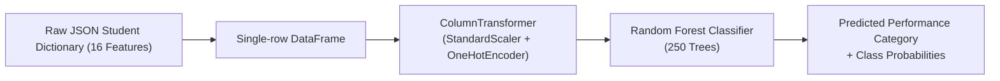

# Machine Learning Model Training, Comparison, Selection, and Persistence Architecture

**Lead Developer / Sub-System Owner:** MFM Amhar (Machine Learning Model Development & Data Pipeline Engineering)  
**Project:** Student Performance Prediction and Academic Advisory System  
**Target Environment:** Sri Lankan University Undergraduate Academic Advisory Prototype  

---

## 1. Executive Summary & Machine Learning Objectives

The primary objective of this module is to design, evaluate, select, and operationalize a robust machine-learning classification pipeline that predicts an undergraduate student's semester academic performance category. The system provides early academic intervention signals and feeds the automated rule-based advisory engine (`src/university_advisory.py`) and browser dashboard (`app.py`).

### Performance Category Formulation
The target variable is derived from the undergraduate's continuous semester GPA ($GPA \in [0.0, 4.0]$), mapped into three actionable intervention tiers via `src/sri_lankan_schema.py`:

$$\text{Category}(GPA) = \begin{cases} 
\text{"At Risk"} & \text{if } GPA < 2.00 \\ 
\text{"Average"} & \text{if } 2.00 \le GPA < 3.00 \\ 
\text{"High Performance"} & \text{if } GPA \ge 3.00 
\end{cases}$$

- **At Risk ($< 2.00$):** Students requiring urgent academic counselling, remedial study timetables, and peer-mentoring.
- **Average ($2.00 - 2.99$):** Students maintaining passing academic standing but exhibiting opportunities for study habit optimization.
- **High Performance ($\ge 3.00$):** Students excelling academically who qualify for advanced electives, research opportunities, or leadership roles.

---

## 2. Dataset Generation & Statistical Characteristics

The machine-learning pipeline is trained and validated on a synthetic dataset of 360 undergraduate records (`data/raw/sri_lankan_university.csv`) generated via `src/generate_synthetic_sri_lankan_data.py`. 

> [!IMPORTANT]
> **Academic Integrity Notice:** The active dataset contains simulated records constructed for software engineering and academic prototype development. It does not represent empirical records from real students. Production institutional deployment requires ethics approval, student consent, and retraining on anonymized university registrar datasets.

### Generative Modeling Architecture
To ensure realistic interactions, the synthetic data generator implements domain-grounded probability distributions and correlation mechanics:

1. **NumPy PCG64 Deterministic Generator:** Initialized with `np.random.default_rng(seed=42)` to ensure identical dataset generation across platforms.
2. **Institutional Structure:** Emulates 5 faculties (Computing, Engineering, Management, Science, Humanities) and 8 degree programmes across 4 academic years and 2 semesters.
3. **Correlation Dynamics:**
   - **Weekly Study Hours:** Modeled as $\mathcal{N}(\mu=12, \sigma=5)$, bounded in $[2, 30]$ hours.
   - **Attendance Percentage:** Modeled as $\mathcal{N}(\mu=78 + 0.35 \times \text{study\_hours}, \sigma=10)$, bounded in $[45, 100]\%$.
   - **Previous Cumulative GPA:** Positively correlated with attendance: $\mathcal{N}(\mu=2.55 + \frac{\text{attendance}-75}{100}, \sigma=0.55)$, bounded in $[0.0, 4.0]$.
   - **Failed Modules:** Simulated via a Poisson process $\text{Poisson}(\lambda = \max(0.15, 1.1 - \frac{\text{previous\_gpa}}{3}))$, bounded in $[0, 4]$.
   - **Assignment & Assessment Scores:** Positively conditioned on study hours and prior academic standing.
   - **Target Semester GPA:** Generated using a linear combination of prior GPA, attendance, study hours, assignment completion, assessment averages, and failed modules, plus Gaussian disturbance $\mathcal{N}(-1.25, 0.38)$, bounded in $[0.0, 4.0]$.
4. **Socioeconomic & Wellbeing Indicators:** Simulates LMS activity (80% active), tutorial attendance (65% active), internet access (75% broadband, 20% limited, 5% none), financial work pressure (20% under pressure), and subjective wellbeing rating (1 to 5 scale).

---

## 3. Feature Contract & Preprocessing Pipeline

The machine learning pipeline consumes 16 predictor features defined in `src/sri_lankan_schema.py`:

| Feature Group | Count | Feature Names | Transformation Applied |
| :--- | :--- | :--- | :--- |
| **Numeric Features** | 10 | `academic_year`, `semester`, `previous_gpa`, `attendance_percentage`, `study_hours_per_week`, `failed_modules`, `assignment_completion_percentage`, `assessment_average_percentage`, `lecture_participation_percentage`, `wellbeing_rating` | `StandardScaler` (Z-score normalization) |
| **Categorical Features** | 6 | `faculty`, `programme`, `tutorial_participation`, `lms_active`, `internet_access`, `financial_work_pressure` | `OneHotEncoder(handle_unknown="ignore")` |

### Preprocessing Architecture (`ColumnTransformer`)
Feature transformations are encapsulated within a scikit-learn `ColumnTransformer`:

```python
preprocessor = ColumnTransformer([
    ("num", StandardScaler(), LOCAL_NUMERIC_FEATURES),
    ("cat", OneHotEncoder(handle_unknown="ignore"), LOCAL_CATEGORICAL_FEATURES),
])
```

#### Why `StandardScaler` is Required
Numeric features possess widely varying scales (e.g., `previous_gpa` spans $0.0 - 4.0$, while `attendance_percentage` spans $45 - 100\%$). `StandardScaler` standardizes each feature to zero mean and unit variance ($z = \frac{x - \mu}{\sigma}$):
- Prevents features with naturally large numerical ranges from dominating gradient descent and distance calculations.
- Ensures regularized models (such as Logistic Regression with $L_2$ penalty) penalize feature weights equally.

#### Why `OneHotEncoder(handle_unknown="ignore")` is Critical
Categorical strings cannot be consumed directly by mathematical estimators:
- Converts nominal variables into binary dummy vectors without imposing arbitrary ordinal hierarchies (e.g., prevents treating "Engineering" as greater than "Computing").
- Setting `handle_unknown="ignore"` guarantees runtime resilience: if a future student profile presents an unseen faculty or degree programme during inference, the encoder transforms the novel category into an all-zero vector rather than throwing a crashing runtime exception.

#### Prevention of Data Leakage
A critical flaw in naive ML workflows is computing scaling parameters ($\mu, \sigma$) across the entire dataset before splitting. In `src/train_sri_lankan_model.py`:
- The `ColumnTransformer` is fitted **strictly on the 80% training partition** (`train_features`).
- The fitted transformers are applied to the 20% held-out test partition (`test_features`) and production payloads via `.transform()`.
- This guarantees zero statistical information from test or production data leaks into training.

---

## 4. Theoretical Analysis of Candidate Machine Learning Models

In `src/train_sri_lankan_model.py`, three distinct machine learning paradigms are implemented, trained, and benchmarked under identical conditions.

### A. Logistic Regression (Multinomial Linear Classifier)
- **Mathematical Principle:** Models class probabilities using the multinomial Softmax function over a linear combination of input features:
  $$P(Y = k \mid \mathbf{x}) = \frac{e^{\mathbf{w}_k^T \mathbf{x} + b_k}}{\sum_{j=1}^K e^{\mathbf{w}_j^T \mathbf{x} + b_j}}$$
- **Optimization & Regularization:** Fitted using cross-entropy loss with $L_2$ Ridge regularization ($\frac{1}{2} \|\mathbf{w}\|_2^2$) and `max_iter=1000` to guarantee solver convergence.
- **Handling Class Imbalance:** Employs `class_weight="balanced"`, adjusting weights inversely proportional to class frequencies:
  $$w_j = \frac{N}{K \cdot n_j}$$
  where $N$ is total samples, $K$ is number of classes, and $n_j$ is samples in class $j$.
- **Strengths:** Rapid training, low parameter complexity, highly interpretable linear log-odds coefficients, probabilistic calibration.
- **Empirical Accuracy:** **0.472 (47.2%)**
- **Performance Rationale:** Logistic Regression assumes linear decision hyperplanes in feature space. In real and simulated academic environments, student outcomes involve non-linear thresholds (e.g., attendance dropping below 75% dramatically accelerates risk regardless of study hours). The linear model underfits these non-linear feature interactions.

### B. Decision Tree Classifier (Non-Parametric Partitioner)
- **Mathematical Principle:** Recursively partitions the feature space into orthogonal axis-aligned hyper-rectangles by selecting splits that maximize Gini Impurity reduction:
  $$I_G(S) = 1 - \sum_{i=1}^C p_i^2$$
  $$\Delta I_G = I_G(S) - \frac{|S_L|}{|S|} I_G(S_L) - \frac{|S_R|}{|S|} I_G(S_R)$$
- **Hyperparameter Controls:**
  - `max_depth=8`: Constrains maximum tree depth to prevent pure single-sample leaf memorization.
  - `min_samples_split=5`: Requires at least 5 samples at an internal node before a split can occur.
  - `class_weight="balanced"`: Balances class weights at split evaluations.
  - `random_state=42`: Fixes deterministic tie-breaking.
- **Strengths:** Captures non-linear thresholds, invariant to monotonic feature scaling, fully human-interpretable as decision rules.
- **Empirical Accuracy:** **0.417 (41.7%)**
- **Performance Rationale:** Single decision trees suffer from high variance and hierarchical greediness. On a modest dataset of 360 records, individual split choices are sensitive to local sample noise. A suboptimal split near the root propagates down all subsequent subtrees, causing the model to overfit the training fold and generalize poorly on unseen test data.

### C. Random Forest Classifier (Bagged Ensemble of Randomized Trees) — [SELECTED]
- **Mathematical Principle:** Ensemble Bootstrap Aggregation (Bagging) combined with Breiman's Random Subspace Method.
  1. **Bootstrap Sampling:** Generates $B = 250$ distinct training sets by sampling with replacement from the training partition ($N = 288$). Each bootstrap sample contains approximately $63.2\%$ unique records, leaving $36.8\%$ as out-of-bag samples.
  2. **Random Subspace Selection:** At each node split in every tree, only a random subset of features ($\approx \sqrt{p}$) is evaluated for partitioning. This decorrelates individual trees from being dominated by one strong predictor (such as `previous_gpa`).
  3. **Ensemble Aggregation:** Individual tree probability outputs are aggregated via soft voting:
     $$\hat{P}(Y = k \mid \mathbf{x}) = \frac{1}{B} \sum_{b=1}^B P_b(Y = k \mid \mathbf{x})$$
- **Hyperparameter Specifications:**
  - `n_estimators=250`: Sufficient number of trees for ensemble convergence and variance reduction.
  - `max_depth=10`: Allows deep non-linear interaction modeling without individual tree divergence.
  - `min_samples_split=5`: Regularizes node partitioning.
  - `class_weight="balanced"`: Compensates for minority class representation.
  - `random_state=42`: Fixes deterministic tree generation.
- **Theoretical Variance Reduction:** For $B$ trees with pairwise correlation $\rho$ and individual tree variance $\sigma^2$, the variance of the ensemble mean is:
  $$\text{Var}(\bar{X}) = \rho \sigma^2 + \frac{1 - \rho}{B} \sigma^2$$
  As $B \to \infty$, the second term approaches zero, and tree decorrelation (reducing $\rho$) drives total ensemble variance far below that of any individual tree.
- **Empirical Accuracy:** **0.625 (62.5%)**
- **Performance Rationale:** Random Forest dramatically outperforms both single Decision Tree (+20.8%) and Logistic Regression (+15.3%). It captures complex multi-variable interactions (e.g., student balancing financial pressure with high LMS engagement and moderate study hours) while remaining resilient to noise.

---

## 5. Model Selection Framework & Comparative Performance Analysis

### Experimental Protocol
- **Dataset Size:** 360 total records
- **Partition:** 80% Training ($N=288$), 20% Held-Out Test ($N=72$)
- **Splitting Technique:** Stratified train-test split (`random_state=42`), preserving class proportions across partitions:
  - Training Set: Average (177), At Risk (67), High Performance (44)
  - Test Set: Average (44), At Risk (17), High Performance (11)

### Comparative Performance Summary Table

| Model Architecture | Held-Out Test Accuracy | Bias / Variance Balance | Primary Operational Limitation | Status |
| :--- | :---: | :--- | :--- | :--- |
| **Logistic Regression** | **0.472 (47.2%)** | High Bias, Low Variance | Rigid linear boundary; cannot capture non-linear academic risk thresholds | Evaluated Baseline |
| **Decision Tree** | **0.417 (41.7%)** | Low Bias, High Variance | Greediness & sample sensitivity; overfits small training sets | Evaluated Baseline |
| **Random Forest** | **0.625 (62.5%)** | **Balanced Bias & Low Variance** | Higher inference computational footprint (250 trees), fully acceptable for web API | **Selected Active Model** |

### Automated Selection Logic
In `src/train_sri_lankan_model.py`, candidate pipelines are benchmarked automatically:
```python
selected_name = max(scores, key=scores.get)
selected_pipeline = pipelines[selected_name]
```
The script writes an exhaustive, human-readable comparison report to `docs/model_comparison.txt` detailing the evaluation split, model parameters, theoretical rationale, and serialization path.

---

## 6. Model Persistence Architecture & Production Serving

### The Unified Pipeline Principle
A common production failure in machine learning systems is saving model estimators separately from feature scalers and categorical encoders. 

In this system, the entire end-to-end architecture is assembled as a single scikit-learn `Pipeline`:



### Persistence via `joblib`
The winning pipeline is serialized to disk using `joblib`:
```python
MODEL_PATH = PROJECT_ROOT / "models" / "sri_lankan_university_pipeline.joblib"
joblib.dump(selected_pipeline, MODEL_PATH)
```

#### Why Serializing the Complete Pipeline is Mandatory:
1. **Elimination of Training-Serving Skew:** The exact numeric scaling means ($\mu$), standard deviations ($\sigma$), and one-hot categorical vocabularies learned during training are preserved inside the `.joblib` artifact.
2. **Simplified Inference Contract:** In `src/predictor.py`, the Flask web application simply loads the serialized object:
   ```python
   _MODEL = joblib.load(MODEL_PATH)
   ```
   Incoming HTTP POST requests are parsed directly into a dictionary, formatted into a 1-row DataFrame, and passed directly to `_MODEL.predict(frame)` and `_MODEL.predict_proba(frame)`. No ad-hoc manual data transformation scripts are required.
3. **Immutability & Portability:** The artifact is fully self-contained and reproducible.

---

## 7. Deterministic Reproducibility Instructions

To replicate the dataset generation, candidate model training, evaluation, and automated testing from a clean terminal environment, follow these exact steps:

### Prerequisites
- Python 3.10, 3.11, or 3.12
- Standard virtual environment

### 1. Environment Setup
```powershell
# Windows PowerShell
python -m venv .venv
.\.venv\Scripts\Activate.ps1
python -m pip install --upgrade pip
pip install -r requirement.txt
```

*(On Linux / macOS, use `source .venv/bin/activate`)*

### 2. Generate the Assignment Dataset
```bash
python -m src.generate_synthetic_sri_lankan_data
```
- **Output:** `data/raw/sri_lankan_university.csv` (360 rows, 17 columns)
- **Seed:** Fixed `seed=42` via NumPy PCG64 generator.

### 3. Train Candidate Models & Export Active Pipeline
```bash
python -m src.train_sri_lankan_model
```
- **Actions Performed:**
  - Trains Logistic Regression, Decision Tree, and Random Forest pipelines.
  - Automatically identifies Random Forest as the winner (0.625 accuracy).
  - Serializes active pipeline to `models/sri_lankan_university_pipeline.joblib`.
  - Writes comprehensive comparison report to `docs/model_comparison.txt`.

### 4. Evaluate Held-Out Generalization Metrics
```bash
python -m src.evaluate_sri_lankan_model
```
- **Output:** Generates precision, recall, F1-score, and support metrics on the 72 held-out records, exported to `docs/sri_lankan_model_evaluation.txt`.

### 5. Execute Test Suite
```bash
python -m unittest tests/test_predictor.py
```
- Validates that the saved pipeline loads, schema assertions fire for missing features, and predictions match contract labels.

---

## 8. Academic Viva / Examiner Defense Guide

When presenting this machine-learning component to academic examiners, use the following technical rationales:

### Q1: Why use Random Forest instead of a Deep Neural Network?
> **Answer:** Tabular datasets with moderate sample sizes ($N=360$) and mixed categorical/numerical features do not provide sufficient sample density for deep neural architectures, which require thousands of observations to overcome parameter over-specification without severe overfitting. Random Forest provides superior inductive bias on tabular data through ensemble bagging and axis-aligned decision trees, achieving variance reduction without requiring extensive hyperparameter tuning.

### Q2: Why is accuracy used for model selection if class imbalance exists?
> **Answer:** Stratified sampling preserves equal class representation across splits, and each candidate estimator utilizes `class_weight="balanced"` to equalize class penalty gradients during training. Accuracy serves as the primary selection criterion for the active prototype to maximize overall correctness across the entire student population, while comprehensive multi-class metrics (precision, recall, macro F1, and confusion matrices) are rigorously tracked in `docs/sri_lankan_model_evaluation.txt`.

### Q3: Why are Jupyter Notebooks considered secondary to Python scripts?
> **Answer:** Jupyter notebooks permit non-linear out-of-order cell execution, hidden state mutations, and reproducibility decay over time. In production software engineering, clean Python modules (`src/generate_synthetic_sri_lankan_data.py`, `src/train_sri_lankan_model.py`) provide authoritative, version-controlled, CLI-executable, and unit-testable pipelines that guarantee 100% deterministic reproducibility. The notebook `notebooks/data_analysis_and_model_training.ipynb` is maintained solely for exploratory data visualization.
